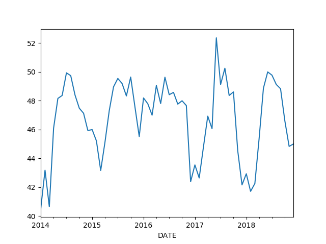
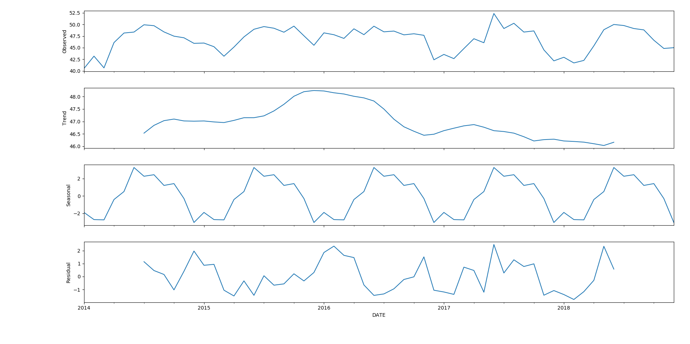
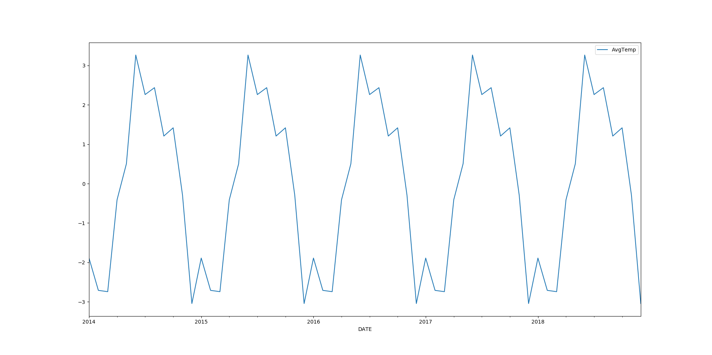
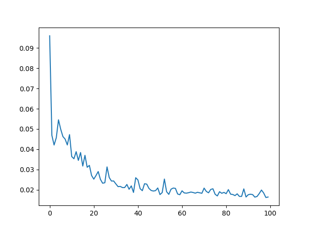
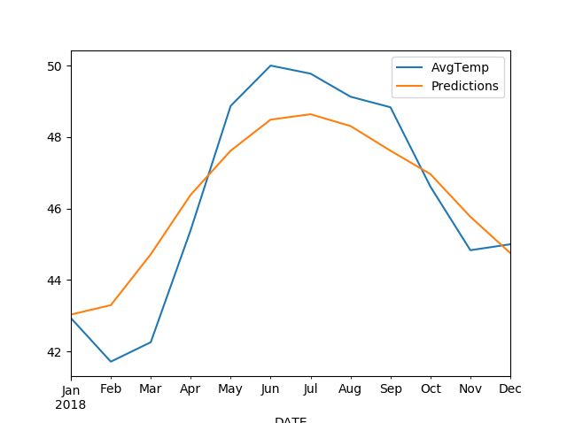

# AvgTempPrediction-RNN-TimeSeries

The dataset for the excercise is in the Data folder. The plot of temperature under study is plotted below

As it seems there is a seasonal componnet in the plot. To ensure seasonality, the plot was decomposed with seasonal_deomcpose of TSA

The decompose part excllusively is plotted below and it can be said that definitely there exists seasonality.

THe RNN model was plotted using Tensorflow. The loss function of the model is plooted below

Finally, the predicted value vs original value is plotted below.

